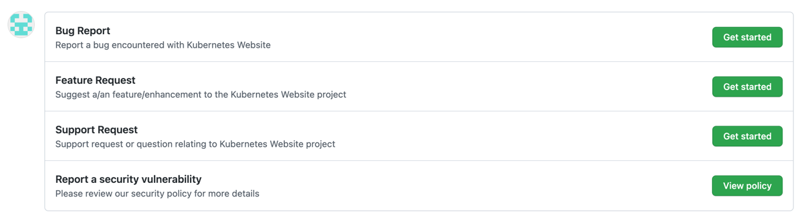

# OSSCA : Kubernetes 한글화 컨트리뷰션 및 커뮤니티 참여(2022)

프로젝트 저장소 : https://github.com/kubernetes/website

### 0주차
##### Action Item 01
kubernetes.slack.com 가입 및 채널 참여
- kubernetes-docs-ko
  - https://kubernetes.slack.com/archives/CA1MMR86S
- sig-docs
  - https://kubernetes.slack.com/archives/C1J0BPD2M
- sig-docs-localizations
  - https://kubernetes.slack.com/archives/C0191RDKHU1

(smkim2339@gmail.com 으로 가입함)
  

##### Action Item 02
kubernetes/website 웹사이트 빌드 시도
- https://github.com/kubernetes/website/blob/main/README-ko.md

  

### 1주차 온라인 회의

- SIG(Special Interest Group)
- k/w : 쿠버네티스 웹사이트
- 기준 브랜치 : main

> ##### 커밋 전 주의사항
> - Commit 전 CLA 작업 진행 후, PR 해야함. 안그럼 막힘  
> - 겹칠 수 있기 때문에 이슈를 열고 하는 걸 추천
> - main 에서 따둔 dev,,,,,ko 브랜치로 가서 거기서 다시 개인 브랜치를 따고 dev로 pr 날림.
main 에 날리는거 아님
> - 한국어 페이지에서 오타 또는 틀린 내용을 찾는 경우에는 이슈중엔 outdated ,, 로 이슈를 이미 등록한 것도 있을 수 있으니
확인 후 시작
> - 이슈열 때 제목은 영어! 내용은 한국어 상관없음.

  

### 2주차 (참석 못하고 녹화본으로)

##### Action Item 01
1) Issue 오픈 및 self-assign (예: https://github.com/kubernetes/website/issues/35258)
2) 작업하여 PR (예: https://github.com/kubernetes/website/pull/35279)
   1) 추천: 용어집 한글화 https://kubernetes.io/ko/docs/reference/glossary

  

##### Action Item 02
diff_l10n_branches.py 실행하여, 
outdated contents 리포트 출력해보기  
https://github.com/kubernetes/website/blob/main/scripts/diff_l10n_branches.py  
커맨드: ./scripts/diff_l10n_branches.py ko upstream/dev-1.24-ko.1 upstream/dev-1.24-ko.2

  

##### Action Item 03
커뮤니티 참여
- sig-docs 에 간략히 인사글 남기기 (영어)
- kubernetes-docs-ko 에 간략히 인사글 남기기 (한국어)
- 한글화팀 회의 참석
  - 일시: 07월 28일(목) 오후 10시
  - 회의 링크(zoom): http://bit.ly/2XAxFEw
  - 회의록: https://goo.gl/1gZ45u
  - https://kubernetes.slack.com/archives/CA1MMR86S/p1658484808568809

  

### 3주차

1. [CLA 가이드](https://github.com/cat-taesik/contribution)
2. 보통 번역의 경우 이슈 생성시, 'Feature Request'

3. ':' 왼쪽의 title 등도 번역 NO(hugo 관련)

4. 중괄호 코드쪽 term_id 번역하면 안됨

5. 한글문서가 이미 있는 경우, 링크 추가해주기 

  

### 4주차

##### Action Items
1. CNCF SLACK 워크스페이스 및 채널에 가입하고 최근 대화 살펴보기  
   a. cloud-native.slack.com  
   b. #glossary / #glossary-localizations / #glossary-localization-korea

2. CNCF Glossary 웹사이트 및 저장소를 살펴보고 컨트리뷰션 일감 찾아보기  
 a. https://github.com/cncf/glossary  
 b. https://glossary.cncf.io/  
 c. https://github.com/cncf/glossary/discussions

3. (optional) PR 오픈해보기

